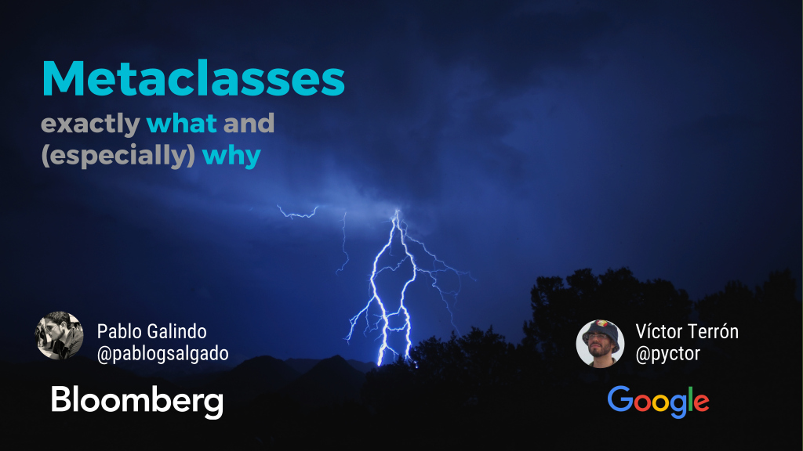

The slides of the talk I gave with [Víctor Terrón](https://github.com/vterron) at [PyConES 2017](https://2017.es.pycon.org/) (Cáceres, Spain). You can [view it online with nbviewer][nbviewer].

[][nbviewer]

- **Title**: *Metaclasses: exactly what and (especially) why*
- **Language**: English
- **License**: [CC BY-SA 4.0](http://creativecommons.org/licenses/by-sa/4.0/)

[nbviewer]: http://nbviewer.jupyter.org/github/pablogsal/pycones2017/blob/master/why-metaclasses.ipynb
